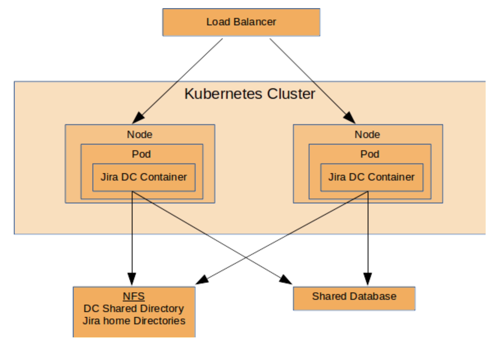

# JIRA ON KUBERNETES

## INTRODUCTION

This document describes how to install a jira datacenter cluster on K8s. It's mainly inspired by the product ASK by Praqma (1), however you can amend any part of it as you wish to end up a fairly different codebase but still functioning as expected. Please have a look into the repos in appendix (2) for it.

As for the time when this document is being written, Atlassian does not officially support running any atlassian applications in K8s cluster and provide any official documentation for it (3). The repo is developed by revieving similar repos and applying some reverse-engineering on them. So, deploying the below configuration is at your decision and you are the sole responsible entitity to get and run it.

## PREREQUSITIES

To run jira on K8s, we need to have the followings:
- A kubernetes cluster. Since service type of "LoadBalancer" is used, a K8s cluster in the cloud is needed. However, you can use an on-premise one as well but then you need to enable ingress controller to expose the service to outside world. In this demo, Google cloud is selected
- A container image having jira software
- A trial jira datacenter license
- A database for storing data. In this example, postgresql running in the same K8s cluster is selected
- A solution for shared storage. It should provide active-active write by many pods running on different nodes. Portworx is selected
- A trial license for portworx

How these ingredients work together is depicted below. Instead of NFS for shared storage, portworx is used in this demo.




## DIRECTORY STRUCTURE
- kubernetes: contains a shell script to spin up a K8s cluster in Google Cloud
- docker: contains a dockerfile and related files to build a jira image
- portworx: contains an installation and manifest file for portworx
- postgres: contains postgres helm package and an installation script
- jira: contains jira helm package that is customised to run on Google Cloud
- images: just for visual images for the content

## INSTALLATION

### Preparing the docker image

Image file is created using the Praqma repo (4). You can try other images that are found in appendix as well. The image should be pushed into  a public container repo. The repo owner name below (mustafafatakan) should be changed with your repo username.
```
cd docker
docker build -t mustafaatakan/jira:praqma .
docker push mustafaatakan/jira:praqma
cd ..
```

### Spinning up the kubernetes cluster

Since portworx requires at least 4 core and 4GB of memory, a 2-node K8s cluster having these resources is created in Google Cloud using the below command. It is assumed that you have gcloud client tool installed and running successfully.
```
cd kubernetes
./install.sh <your_project_name> <your_cluster_name>
cd ..
```

### Installing Portworx

Portworx is installed by following the guidelines in its documentation (5). In the same documentation page, there is a link about how to create the required manifest file to install it (6). A customised manifest file (portworx.yml) is already created and stored in this repo. Be cautious that this file containes some key and licence values specific to this installation, so you may need to follow the link provided in order to obtain a new one.
```
cd portworx
./install.sh
cd ..
```

### Installing Posgresql database

Postgresql helm package is installed for a shared database. A customised helm package is kept locally in this repo and it is exactly same as "stable/postgresql" except this has "files/postgresql.conf" file that is mounted to the postgresql container at run time. The only change in this file is "max_connections" (default 100, here increased to 200) in order to let more than 2 jira containers be able connect to it. One jira container needs about 45 connections. 
```
cd postgres
./install.sh
cd ..
```

### Installing Jira

Now, every prerequisites for jira are ready. The jira helm repo package from Praqma (7) is downloaded and customised in this demo. So, you do not need to download it. However, it's not the aim for this demo but if you need it later, it can be downloaded using the commands below.
```
helm repo add praqma https://praqma-helm-repo.s3.amazonaws.com/
helm repo update
helm repo list
helm search jira
helm fetch praqma/jira
```

In order to chase up what is customised, you can follow the changes by searching the commnets edited by "mustafa".
```
cd jira
helm --name  praqmajira install .
cd ..
```

The above helm package installs a single pod statefulset of jira. You first need to configure and see it's running successfully. Then we can scale it out to 2 and 3.

#### Configuring the first pod

- Get its Load Balancer IP. Initially it may be in "pending" state, you should wait a while until it becomes available.
```
kubectl get svc praqmajira-2
```
Actually, in this demo two different services for jira are created that is different than the original helm package where only one headless service is created. The first service "praqmajira" is headless and the same as orjinal. However the second one "praqmajira-2" is a LoadBalancer service in order to get access from outside world. The latter service is needed as ingress controller is disabled. 
- Add a line to your /etc/hosts file in order to be able to hit the IP of your jira cluster.
```
/etc/hosts file
...
...
<load_balancer_IP> 	jira.example.com
...
```
- Create a zone in your Google Cloud DNS named "example.com" and add an A record of "jira.example.com" with the Load Balancer IP
- Open your browser and connect your first pod using "http://jira.example.com" and follow the instructions to complete the configuration. You shall opt for the followings:
```
I'll set it up myself
opt for my own database
select postgresql and enter hostname=postgres-postgresql, port=5432, dbname=jira, username=jira_user, passwd=jira_passwd
test connection and proceed if successful
trial license
and follow the configuration steps to the end
```

After configuration is completed, monitor the output of jira container (kubectl logs ...) and watch for until it boots up successfully after finishing upgrades. Then, go to Settings->System->System Info in order to see the status and members of the cluster. At the bottom, you can see which pod you are connected to.

Now, go to the jira home folder of the container (/var/atlassian/application-data/jira/) and you can see the configuration file "dbconfig.xml". You will need this file while scaling out the jira statefulset.

#### Scaling out Jira to 2 pods

To scale out, you first need to create the second pod with "kubectl scale ...". However, the second pod needs to be told that it is the second member of the cluster. In order to that, you need to copy the content of "dbconfig.xml" file obtained in previous step to the second container. There is no "server.id" value to be changed as in the confluence installation. Because the server id information is kept in "cluster.properties" file which contains the correct value as soon as it is scaled out to 2. Therefore, you do not need to edit anything on the second pod. After copying "dbconfig.xml", delete the second pod so that the new configuration can take place.
```
kubectl scale statefulset praqmajira --replicas=2
copy the content of "dbconfig.xml" of first container to the second container
chmod 640 dbconfig.xml
kubectl delete pod praqmajira-1 --grace-period=0 --force
```

Now, monitor the "System Info" page on GUI while the second pod is booting up as a cluster member. After joining the cluster, it will create all the required folders and files including indices. You can monitor the logs of it (/var/atlassian/application-data/jira/log/atlassian-jira.log) by logging into the container. Actually, jira outputs more detailed info into this log file than the standard output which you can monitor "kubectl logs ..."

#### Scaling out Jira to 3 pods

Follow the steps in the previous step


### Testing the cluster

Now, you should see all 3 members of the cluster in the GUI. You can delete one, two or even all of them and see how magnificient kubernetes help them to successfully form the cluster again. 


## FUTURE WORK
- "dbconfig.xml" file should be injected into containers using configmap instead of copying manually
- TLS certificates should be introduced


I hope you have enjoyed it.


## APPENDIX
(1)
- https://www.praqma.com
- https://www.atlassian.com/company/events/summit-europe/watch-sessions/2018/scaling-atlassian/atlassian-data-center-in-kubernetes-the-cloud-native-way

(2)
- https://hub.docker.com/r/dchevell (Unofficial repository that provide atlassian applications' docker images such as jira)
- https://bitbucket.org/dchevell/docker-atlassian-jira-core
- https://confluence.apwide.com/display/TEM/Dockerize+your+Atlassian+Tools (Good documentation about alternatives. It only gives clues about how to migrate data for jira from server to container)
- https://github.com/int128/devops-kompose (Helm packages installing confluence and jira using deployments)
- https://github.com/Bonn93/atlassian-kubernetes (Example of deploying with statefulsets)
- https://github.com/kelseyhightower/jira-on-kubernetes (Example of deploying with daemonsets using a base centos image)
- https://hub.docker.com/r/ivantichy/jira/
- https://github.com/ivantichy/jira-docker
- https://hub.docker.com/r/cptactionhank/atlassian-jira/

(3)
- https://community.atlassian.com/t5/Jira-questions/Official-Atlassian-support-for-JIRA-on-Docker/qaq-p/568641

(4)
- https://github.com/Praqma/confluence

(5)
- https://docs.portworx.com/portworx-install-with-kubernetes/cloud/gke/#create-a-gke-cluster

(6)
- https://docs.portworx.com/portworx-install-with-kubernetes/cloud/gke/#

(7)
- https://praqma-helm-repo.s3.amazonaws.com/
